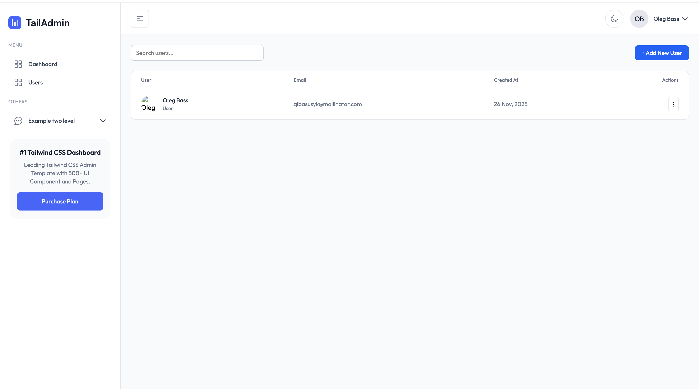

# TailAdmin Laravel Starter Kit 

This starter kit is based on [TailAdmin Laravel - Free Laravel Dashboard](https://github.com/TailAdmin/tailadmin-laravel).


As a result, you get full **simple** Laravel Auth (*login, register, forget password, profile*), styled as TailAdmin.



 

The main point is no React/Vue/Livewire required. Only Blade and Tailwind.

Inside [TailAdmin](https://tailadmin.com/), there are many more components and pages, so explore them and add them manually. This repository is created as a **starter** kit.

---

## How to use

To use this kit, you can install it using:

```

```

From there, you can modify the kit to your needs.